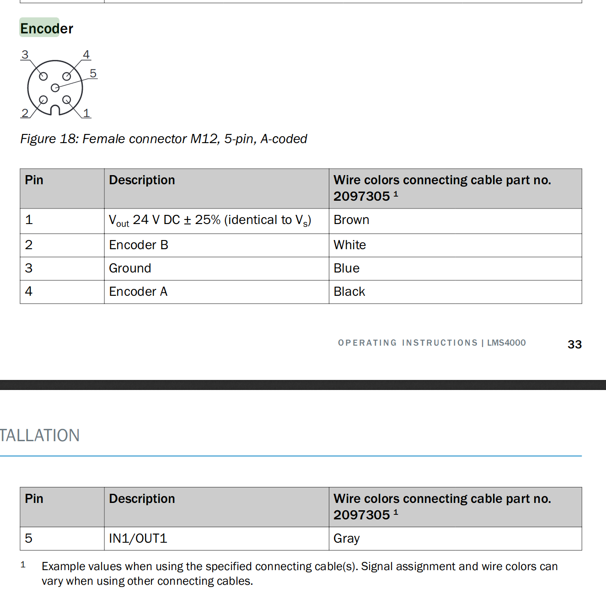
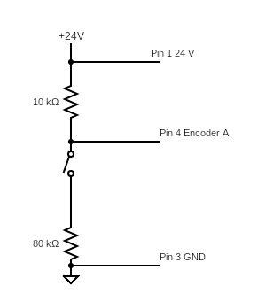
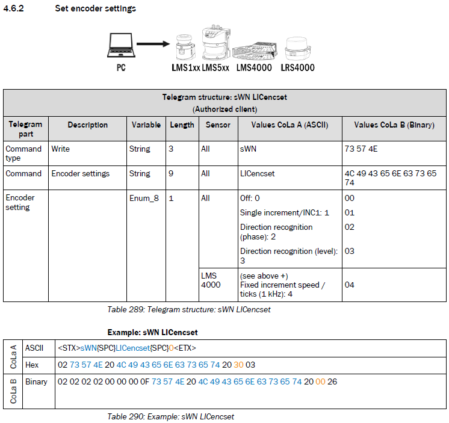

# Encoder in Laserscanners
See also [LMS4xxx Manual](https://cdn.sick.com/media/docs/0/90/790/Operating_instructions_LMS4000_2D_LiDAR_sensors_en_IM0079790.PDF)

3.5.3.3

Connecting encodersIf the device is mounted for mobile use or if the objects to be measured are in motion,the application will usually also need position data to further process the measured val‐ues.Encoders can be connected for this purpose. The encoder data is then available withthe other measured values in a single scan and at the same interface. A volume,for example, can be calculated by evaluating the measurement data. The input fre‐quency of the encoder signal must not exceed 50 kHz.The following encoders with push-pull output stage can be used:
1. Single-channel, only connected at encoder A, no direction detection.
2. Dual-channel (phase), connected at encoder A and encoder B; the pulses have aphase shift of 90°, making direction detection possible. By definition, during for‐ward motion (CW = clockwise) phase A precedes phase B; conversely, duringreverse motion (CCW = counterclockwise) edge A rises before edge B.
3. Dual-channel (level), connected at encoder A and encoder B; the pulses are atencoder A; at encoder B, the direction is indicated by level 0 or level 1 (rarely).


## connecting encoders




### Example Circuit to trigger encoder counts
Whenever the switch is closed a potential of 24 V is applied to the encoder input A in mode (01 single-channel) this leads to an increase of the count by 1.



### Activation of Encoder Informations
If the parameter ```encoder_mode``` is set to 1-4 in the launch file, the encoder is activated in the laser scanner in the corresponding mode (see list above).

The following encoder modes can be configured in the launchfile or by commandline parameter:
* `encoder_mode:=-1`: Default value, i.e. encoder configuration not set
* `encoder_mode:=0`: Encoder off (supported by LMS1xx, LMS5xx, LMS4000, LRS4000)
* `encoder_mode:=1`: Single increment (supported by LMS1xx, LMS5xx, LMS4000, LRS4000)
* `encoder_mode:=2`: Direction recognition phase (supported by LMS1xx, LMS5xx, LMS4000, LRS4000)
* `encoder_mode:=3`: Direction recognition level (supported by LMS1xx, LMS5xx, LMS4000, LRS4000)
* `encoder_mode:=4`: Fixed increment speed/ticks (supported by LMS4000 only)

Encoder messages are published on topic `/encoder` synchronously to the PointCloud messages. They contain a timestamp and the encoder value, e.g.:
```console
foo@bar:~$rostopic echo /encoder
header:
  seq: 20700
  stamp:
    secs: 1570722972
    nsecs:  28866142
  frame_id: "Encoder"
enc_count: 836
---
header:
  seq: 20701
  stamp:
    secs: 1570722972
    nsecs:  30598181
  frame_id: "Encoder"
enc_count: 836
---
header:
  seq: 20702
  stamp:
    secs: 1570722972
    nsecs:  32138020
  frame_id: "Encoder"
enc_count: 836
```



