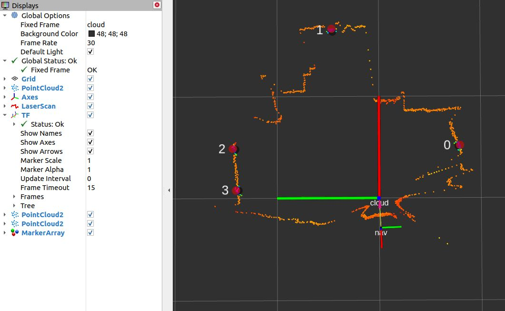

# NAV350

NAV-350 devices are supported by sick_scan_xd since 2023. Since they support navigation and use a different communication mode, this chapter gives an overview of the NAV-350 support in sick_scan_xd. Please refer to the manuals for further information.

## Process loop

Scan data, landmarks and poses of NAV-350 devices are queried by SOPAS commands with polling. Therefore the sick_scan_xd process loop runs as followed:

1. Initialization and setup

2. Main loop (polling):<br/>
   1 . Send data request "sMN mNPOSGetData 1 2"<br/>
   2 . Receive and parse response<br/>
   3 . Convert and publish pointcloud, laserscan, landmarks, pose and transform<br/>
   4 . API: notify listeners and run their callback functions<br/>
   5 . Repeat from step 1<br/>

3. In case of incoming odometry messages (asynchron):<br/>
   1 . Convert to SOPAS command<br/>
   2 . Send "sMN mNPOSSetSpeed <odom_data>" to NAV350<br/>

## Initialization and setup

After initialization, sick_scan_xd switches to navigation mode by default. Navigation requires mapping (i.e. a valid landmark layout), which can be done by
* SOPAS ET (recommended), or
* optional mapping with parameter `nav_do_initial_mapping:=True` using the landmarks detected at start, or
* using an optional imk-file.

Configuration and setup using SOPAS ET is most powerful and recommended. 

The default sopas initialization sequence runs as followed:
```
"sMN SetAccessMode 3 F4724744"     # switch to access level authorized client
"sMN mNEVAChangeState 1"           # switch to operation mode standby
"sWN NEVACurrLayer <layer>"        # set layer configured by launchfile
"sWN NLMDLandmarkDataFormat 0 1 1" # set result format (landmark data)
"sWN NAVScanDataFormat 1 1"        # set result format (scan data)
"sWN NPOSPoseDataFormat 1 1"       # set result format (pose data)
"sMN mNEVAChangeState 4"           # switch to navigation mode
"sMN mNPOSGetData 1 2"             # query pose, landmark and scan data
```

If optional parameter `nav_do_initial_mapping` is true, a landmark layout is initialized using the reflectors detected at startup (sopas command "sMN mNMAPDoMapping"). The sopas initialization sequence for an initial mapping runs as followed:
```
"sMN SetAccessMode 3 F4724744"     # switch to access level authorized client
"sMN mNEVAChangeState 1"           # switch to operation mode standby
"sWN NEVACurrLayer <layer>"        # set layer configured by launchfile
"sWN NLMDLandmarkDataFormat 0 1 1" # set result format (landmark data)
"sWN NAVScanDataFormat 1 1"        # set result format (scan data)
"sWN NPOSPoseDataFormat 1 1"       # set result format (pose data)
"sMN mNEVAChangeState 2"           # switch to mapping mode
"sMN mNLAYEraseLayout 1"           # clear landmark layout
"sWN NMAPMapCfg ..."               # configure mapping parameter
"sWN NLMDReflSize <size>"          # set reflector size configured by launchfile
"sMN mNMAPDoMapping"               # detect landmarks and run mapping
"sMN mNLAYAddLandmark ..."         # add all detected landmarks to the layout
"sMN mNLAYStoreLayout"             # store landmark layout
"sMN mNEVAChangeState 4"           # switch to navigation mode
"sMN mNPOSGetData 1 2"             # query pose, landmark and scan data
```

The landmark layout stored in an imk-file can optionally loaded at startup with optional parameter `nav_set_landmark_layout_by_imk_file`. File [20230126_nav350_4reflectors_moving.imk](../test/emulator/scandata/20230126_nav350_4reflectors_moving.imk) shows an example. See the NAV-350 manual for details about imk-files.

The settings are configured in launchfile [sick_nav_350.launch](../launch/sick_nav_350.launch).

## Messages

sick_scan_xd polls the NAV350 scan data, reflectors and poses in its main loop. Scan data are published by pointcloud messages (in topic "cloud" by default). Reflectors are published by type `sick_scan_xd/NAVLandmarkData` on topic "/sick_nav_350/nav_landmark" and as MarkerArray on topic "/sick_nav_350/nav_reflectors" for easy visualization using rviz. Poses are published by type `sick_scan_xd/NAVPoseData` on topic "/sick_nav_350/nav_pose" and as ros transform on topic "/tf".

The following rviz-screenshot shows the pointcloud, landmarks and pose of a NAV-350:



### Odometry messages

Odometry messages can be sent to the NAV-350 device using ROS messages `nav_msgs/Odometry` on topic "/sick_nav_350/odom" or `sick_scan_xd/NAVOdomVelocity` on topic "/sick_nav_350/nav_odom_velocity". Odometry messages `sick_scan_xd/NAVOdomVelocity` specify the velocity (vx, vy) in m/s in lidar coordinates. Odometry messages `nav_msgs/Odometry` specify the velocity (vx, vy) in m/s in ros coordinates. The angular velocity is expected in radians/s.

Example odometry messages with vx = 1 m/s, vy = -1 m/s and omega: 0.5 rad/s:
```
rostopic pub --rate 10 /sick_nav_350/nav_odom_velocity sick_scan_xd/NAVOdomVelocity '{vel_x: 1.0, vel_y: -1.0, omega: 0.5, timestamp: 123456789, coordbase: 0}‘
rostopic pub --rate 10 /sick_nav_350/odom nav_msgs/Odometry '{twist: { twist: { linear: {x: 1.0, y: -1.0, z: 0.0}, angular: {x: 0.0, y: 0.0, z: 0.5}}}}'
```


