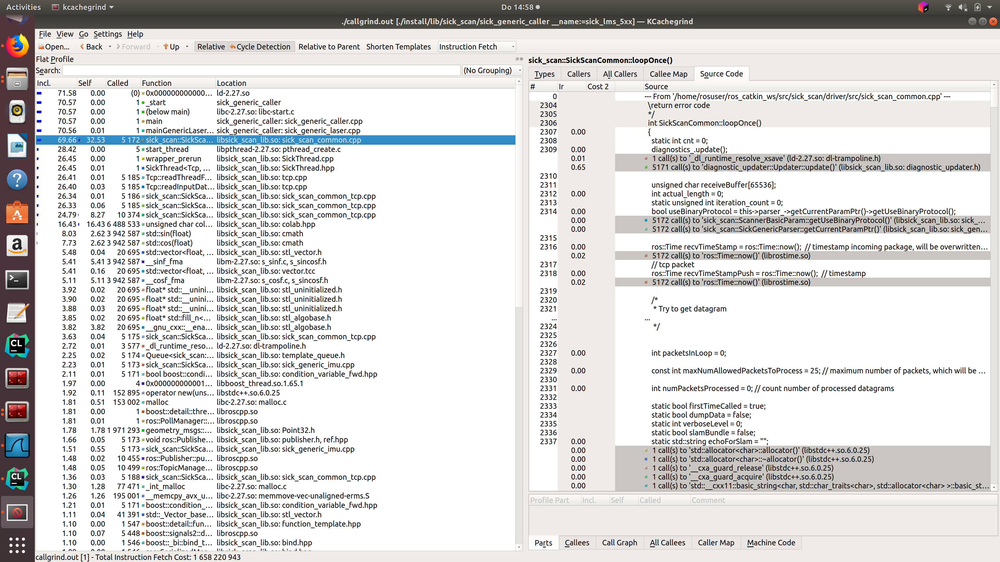
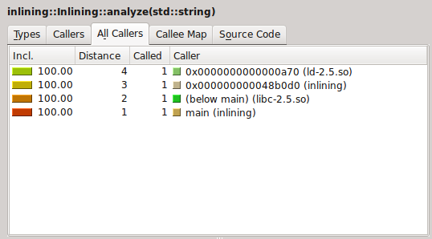
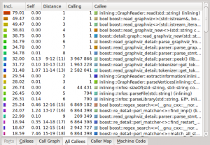

# Profiling

## Table of contents

- [Introduction](#introduction)
- [Installation](#installation)
- [Usage](#Usage)
## Introduction

Since the existing node can basically be used on different platforms, bottlenecks can occur with weak hardware. To better analyze these bottlenecks, software profiling can be performed.
The following example shows how to perform profiling.
For further details on profiling, please refer to https://baptiste-wicht.com/posts/2011/09/profile-c-application-with-callgrind-kcachegrind.html, for example.

## Installation

First of all, you need to install Callgrind and KCachegrind. 
You also need to install graphviz in order to view the call graph in KCachegrind. The applications are already packaged for the most important Linux distributions. You can just use apt-get to install them:
```
sudo apt-get install valgrind kcachegrind graphviz
```

## Usage
We have to start by profiling the application with Callgrind. To profile an application with Callgrind, you just have to prepend the Callgrind invocation in front of your normal program invocation:
```
valgrind --tool=callgrind program [program_options]
```
### Starting profiling for sick_scan_xd
In order to establish a reference to the source code during profiling, the program must be compiled with debug symbols, this can be done with catkin_make
```
catkin_make install -DCMAKE_BUILD_TYPE=Debug
```
It is necessary to create a rosmaster so that the sick_scan_xd node can connect to it because we can't use roslaunch during profiling.
```
roscore
```
To set the parameters we start a node as usual with roslaunch.
```
roslaunch sick_scan_xd sick_lms_5xx.launch hostname:=192.168.0.151
```
While this node is running we can use ```ps -aef| grep sick_scan_xd``` to determine the program path and the call parameters. 
```
rosuser@ROS-NB:~$ ps -aef|grep sick_scan_xd
rosuser   4839  2443  0 14:43 pts/1    00:00:00 /usr/bin/python /opt/ros/melodic/bin/roslaunch sick_scan_xd sick_lms_5xx.launch hostname:=192.168.0.151
rosuser   4854  4839  1 14:43 ?        00:00:03 /home/rosuser/ros_catkin_ws/devel/lib/sick_scan_xd/sick_generic_caller __name:=sick_lms_5xx __log:=/home/rosuser/.ros/log/f9861670-304c-11e9-9839-54e1ad2921b6/sick_lms_5xx-1.log
rosuser   4910  4875  0 14:46 pts/6    00:00:00 grep --color=auto sick_scan_xd
```
now we can close the node and restart with callgrid
```
valgrind --tool=callgrind program /home/rosuser/ros_catkin_ws/devel/lib/sick_scan_xd/sick_generic_caller __name:=sick_lms_5xx
```
The result will be stored in a callgrind.out.XXX file where XXX will be the process identifier.
You can read this file using a text editor, but it won't be very useful because it's very cryptic. 
That's here that KCacheGrind will be useful. You can launch KCacheGrind using command line 
or in the program menu if your system installed it here. Then, you have to open your profile file.

The first view present a list of all the profiled functions. You can see the inclusive 
and the self cost of each function and the location of each one.



Once you click on a function, the other views are filled with information. The view in uppper right part of the window gives some information about the selected function.



The view have several tabs presenting different information:

Types : Present the types of events that have been recorded. In our case, it's not really interesting, it's just the number of instructions fetch
Callers : List of the direct callers
All Callers : List of all the callers, it seems the callers and the callers of the callers
Callee Map : A map of the callee, personally, I do not really understand this view, but it's a kind of call graph representing the cost of the functions
Source code : The source code of the function if the application has been compiled with the debug symbol
And finally, you have another view with data about the selected function.



Again, several tabs:

* Callees : The direct callees of the function
* Call Graph : The call graph from the function to the end
* All Callees : All the callees and the callees of the callees
* Caller Map : All functions are represented as blocks the size corresponds to their CPU time. Callees are stacked on the callers. 
* Machine Code : The machine code of the function if the application has been profiled with --dump-instr=yes option
You have also several display options and filter features to find exactly what you want and display it the way you want.

The information provided by KCacheGrind can be very useful to find which functions takes too much time or which functions are called too much.

This text is an adopted version of https://baptiste-wicht.com/posts/2011/09/profile-c-application-with-callgrind-kcachegrind.html .

Thanks to Baptiste Wicht.
