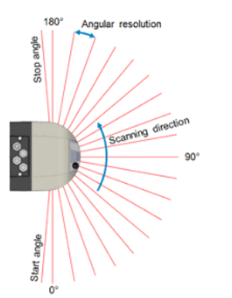

# Timestamping

Often there is a requirement that the time stamp of the measurements should be calculated for each individual shot. 
This article explains some background information about the determination of these time stamps. Here the statements refer to the LMS511. However, they can be transferred to other lidars using the same logic.

The lidar sends a pulsed beam onto a rotating mirror. Since the speed of rotation is relatively low, this mirror serves as transmitter and receiver.

The direction of rotation can be seen in the drawing.

25 scans per second means that the mirror makes 25 360° rounds per second. The actual laser unit is only active during the 190°. Therefore the so-called duty cycle is 190/360. The rotation is unaccelerated, so that the lidar arrives at the same angular direction again after 40 ms (1/25). From the angular distance from shot to shot you can calculate the pulse rate of the laser. For example, if the angular difference from shot to shot is 0.1 degree, the so-called shot rate would be: 360/0.1 * 25 shots/second.

A scan means the group of all shots during one revolution. Just imagine the lidar as a lighthouse that rotates evenly and measures the distance values over time of flight in a certain sector (here 190°) with the above mentioned shot rate. Also you find some background material in the documentation of SICK.

In the transmission protocol of the lidar two points in time are given in so-called ticks (resolution in microseconds):
a) Start of the scans in ticks
b) Start of IP data transfer from lidar to PC in ticks

It is assumed that the transfer between lidar and PC is near latency-free.
The software PLL generates an assignment between the tick of the IP data transmission and the system time of the PC via an estimated line mapping. On the basis of this straight line equation, the start of the scan is then calculated relative to the system time. This generation time stamp is the time of the first shot of the scan. This timestamp is assigned to the pointcloud timestamp. From there, the rotation speed and the angular distance from shot to shot can be used to approximately calculate the time for each shot.

More details can be found [here](https://github.com/SICKAG/sick_scan_xd/blob/master/doc/timing.md)
