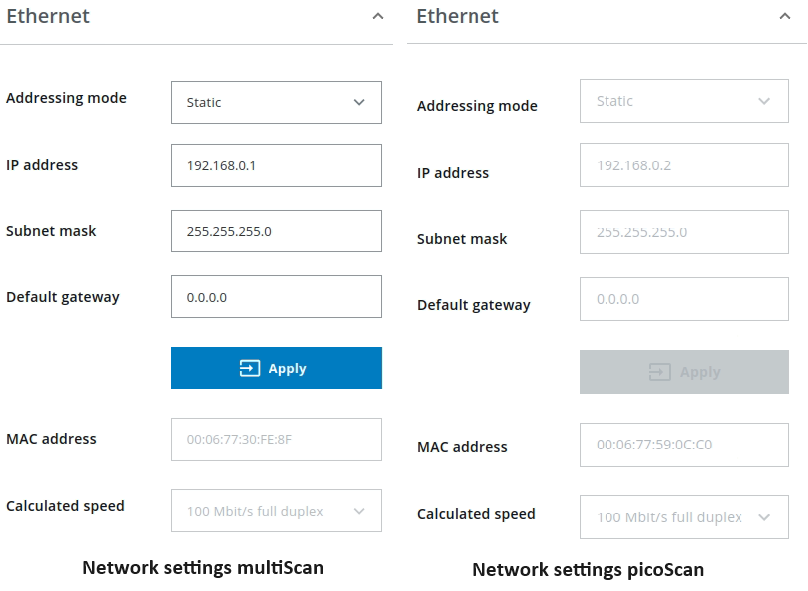
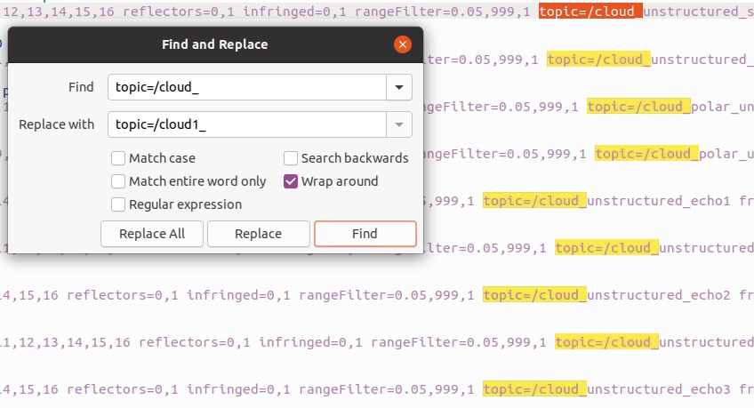
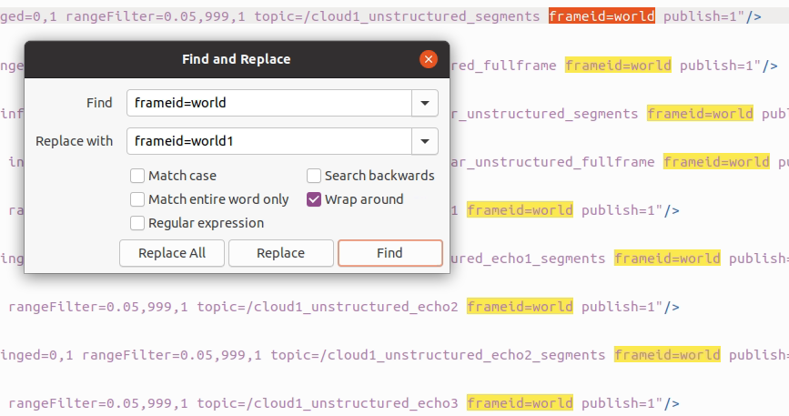
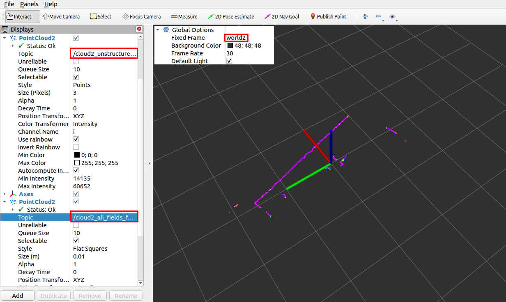
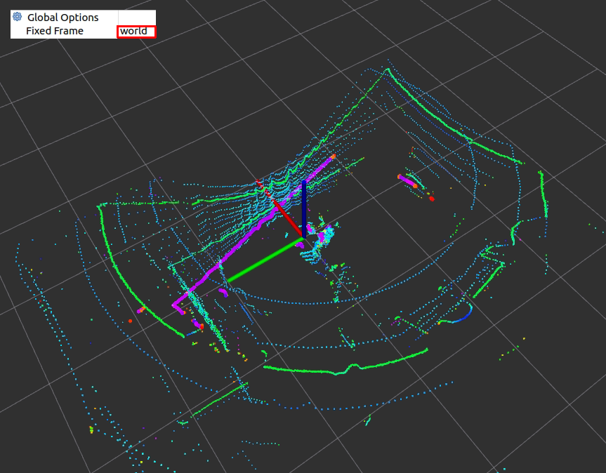

# How to run multiple sensors concurrently

To support multiple sensors, sick_scan_xd has to be started multiple times, with one sick_scan_xd-node for each sensor. By default, each sick_scan_xd-node connects to "192.168.0.1" and publishes its pointcloud on topic "cloud". Therefore both the node name, the ip-address of the sensor and the pointcloud topic have to be configured differently for each node. 

Node name, ip-address and pointcloud topic can be configured in the launch-file or by commandline argument:

* Topic, nodename and ip configuration in a launch-file (example for TiM7xx):
    ```
    <launch>
        <arg name="nodename" default="sick_tim_7xx"/>
        <arg name="hostname" default="192.168.0.1"/>
        <arg name="cloud_topic" default="cloud"/>
        <node name="$(arg nodename)" pkg="sick_scan_xd" type="sick_generic_caller" respawn="false" output="screen">
            <param name="scanner_type" type="string" value="sick_tim_7xx"/>
            <param name="nodename" type="string" value="$(arg nodename)"/>
            <param name="hostname" type="string" value="$(arg hostname)"/>
            <param name="cloud_topic" type="string" value="$(arg cloud_topic)"/>
    ```

* Topic, node name and ip configuration by commandline (ROS1-example for TiM7xx):
    ```
    roslaunch sick_scan_xd sick_tim_7xx.launch nodename:=sick_tim_7xx_1 hostname:=192.168.0.1 cloud_topic:=cloud_1
    roslaunch sick_scan_xd sick_tim_7xx.launch nodename:=sick_tim_7xx_2 hostname:=192.168.0.2 cloud_topic:=cloud_2
    ```

* Topic, node name and ip configuration by commandline (ROS2-example for TiM7xx):
    ```
    ros2 run sick_scan_xd sick_generic_caller ./src/sick_scan_xd/launch/sick_tim_7xx.launch nodename:=sick_tim_7xx_1 hostname:=192.168.0.1 cloud_topic:=cloud_1
    ros2 run sick_scan_xd sick_generic_caller ./src/sick_scan_xd/launch/sick_tim_7xx.launch nodename:=sick_tim_7xx_2 hostname:=192.168.0.2 cloud_topic:=cloud_2
    ```

Scripts [run_linux_ros1_simu_tim7xx_twin.bash](../test/scripts/run_linux_ros1_simu_tim7xx_twin.bash) and [run_linux_ros2_simu_tim7xx_twin.bash](../test/scripts/run_linux_ros2_simu_tim7xx_twin.bash) show a complete example with emulation of two TiM7xx sensors and two sick_scan_xd nodes running concurrently using different nodenames and topics.

To run two multiScan or picoScan devices simultanously, each sick_scan_xd node must be configured with different lidar ip addresses and udp ports, different node names, different ros topics and frame ids for each point cloud. Therefore the following launchfile parameter should be overwritten by individual settings for each lidar:
* "hostname": e.g. "192.168.0.190" and "192.168.0.98"
* "nodename": e.g. sick_picoscan0" and "sick_picoscan1"
* "publish_frame_id": e.g. "world0" and "world1"
* "publish_laserscan_segment_topic": e.g. "scan0_segment" and "scan1_segment"
* "publish_laserscan_fullframe_topic": e.g. "scan0_fullframe" and "scan1_fullframe"
* "imu_topic": e.g. "imu0" and "imu1"
* "udp_port": e.g. "56661" and "56662"
* "imu_udp_port": e.g. "7503" and "7504"
* individual topics and frame ids for each customized point cloud, e.g.
    * replace all "topic=/cloud_" by "topic=/cloud0_" resp. "topic=/cloud1_"
    * replace all "frameid=world" by "frameid=world0" resp. "frameid=world1"
It is recommend to first verify the launchfile configurations separately for each picoScan before running them simultanously.

For picoScan and multiScan, parameter udp_receiver_ip must be set to the ip address of the PC running sick_scan_xd. It is recommend to use ip addresses in the same subnet.

**Note: The sick_scan_xd API does not support running multiple lidars simultaneously in a single process.** Currently the sick_scan_xd API does not support the single or multi-threaded use of 2 or more lidars in one process, since the sick_scan_xd library is not guaranteed to be thread-safe. To run multiple lidars simultaneously, we recommend using ROS or running sick_scan_xd in multiple and separate processes, so that each process serves one sensor.

## Example: Run multiScan and picoScan simultaneously

The following example shows a multiScan and a picoScan device running simultaneously on ROS-1. The ip address of the multiScan is `192.168.0.1` (default), the ip address of the picoScan has been set to `192.168.0.2`. The Linux-PC running sick_scan_xd uses ip address `192.168.0.100`. `fping -a -q -g 192.168.0.0/24` shows all available devices in subnet `192.168.0.x`:


| device | ip |
|--------|----|
| 192.168.0.1 | multiScan |
| 192.168.0.2 | picoScan |
| 192.168.0.100 | Linux-PC |

Open 192.168.0.1 and 192.168.0.2 in a browser to view the network settings with SOPAS Air:



The frame ids and ros topics of both lidars should be configured differently. Copy both launchfiles (sick_multiscan.launch and sick_piocscan.launch in this example) e.g. to lidar1.launch and lidar2.launch and replace ros topics and frame ids, e.g.
    * replace all "topic=/cloud_" by "topic=/cloud1_" in lidar1.launch
    * replace all "topic=/cloud_" by "topic=/cloud2_" in lidar2.launch
    * replace all "frameid=world" by "frameid=world1" in lidar1.launch
    * replace all "frameid=world" by "frameid=world2" in lidar2.launch





Provide the launchfiles with `catkin_make_isolated --install --cmake-args -DROS_VERSION=1`.

Then launch sick_scan_xd twice with two different launchfiles, ip addresses, node names, udp ports, topic and frame ids.

Example:

`
roslaunch sick_scan_xd lidar1.launch hostname:=192.168.0.1 udp_receiver_ip:=192.168.0.100 nodename:=lidar1 udp_port:=2115 imu_udp_port:=7503 publish_frame_id:=world1 publish_laserscan_segment_topic:=scan1_segment publish_laserscan_fullframe_topic:=scan1_fullframe imu_topic:=imu1 &
`

`
roslaunch sick_scan_xd lidar2.launch hostname:=192.168.0.2 udp_receiver_ip:=192.168.0.100 nodename:=lidar2 udp_port:=2116 imu_udp_port:=7504 publish_frame_id:=world2 publish_laserscan_segment_topic:=scan2_segment publish_laserscan_fullframe_topic:=scan2_fullframe imu_topic:=imu2 &
`

Rviz shows the point clouds of both lidars running simultaneously, with frame id `world1` for lidar1 (multiScan) and frame id `world2` for lidar2 (picoScan):




If the 6D poses of the lidars are known, their coordinates can be transformed to a common frame by a static_transform_publisher. Example:

```
rosrun tf static_transform_publisher 0 0 0 0 0 0 world world1 100 &
rosrun tf static_transform_publisher 0 0 0 0 0 0 world world2 100 &
```



The big purple dots show the picoScan pointcloud, the other points are the multiScan point clouds. Both are transformed to the common frame id `world`. Note that both point clouds do not match exactly, because the 6D poses are just assumed to be (x=0, y=0, z=0, yaw=0, pitch=0, roll=0) in this example.